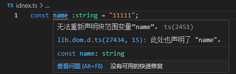

# Ts代码学习

## 快速入门
ts 的安装
``` npm i typescript --save-dev```
检查ts
``` npm tsc ``` 
使用上的小问题
1. 默认情况ts会假设当前在dom环境；
2. 如果代码中没有模块化语句，默认代码是全局执行的，所以变量是全局变量，会有变量名冲突的风险，会爆如下错误；要最简单的解决就是加上模块化代码

3. ts默认编译的目标代码是ES3
### tsconfig.js
全局安装   ``` npm i -g ts-node ```,可以在内存编译成js
    命令行执行：``` ts-node + 对应文件路径 ```
全局安装   ``` npm i nodemon -D ```, 可以帮助你监听文件，每次保存文件就可以帮你执行一些命令
    script 脚本添加 ``` nodemon --exec ts-node src/index.ts```